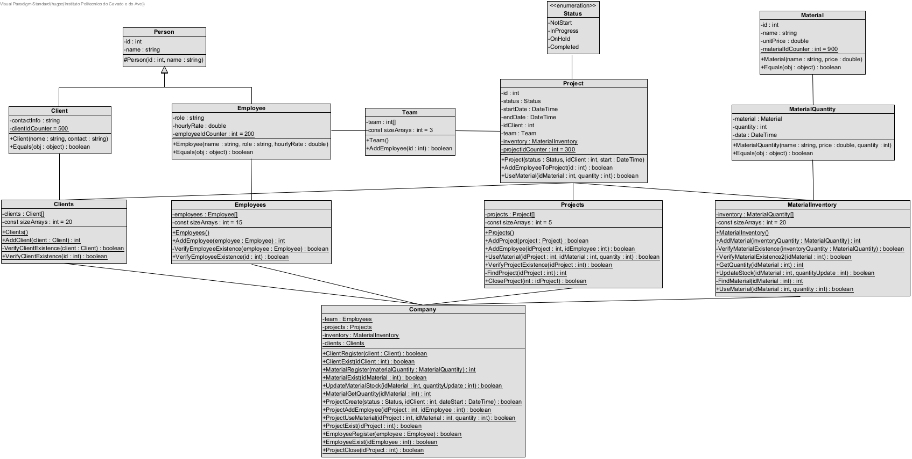

---

## Features

- **N-Tier Architecture**: Organizes the application into 6 distinct layers to ensure data integrity and controlled access.
- **Singleton Design Pattern**: Guarantees unique instances for key collections such as clients, employees, and materials.
- **SOLID Principles**: Promotes clean and robust code design:
- **Generic Collections**: Utilizes `List` and `Dictionary` for dynamic and efficient data handling.
- **Polymorphism**: Overloaded methods adapt based on input parameters.
- **Interfaces**: Implements `IComparable<T>` for sorting and comparison.
- **XML Documentation**: Enhances code readability and future development.
- **Error Codes**: Dedicated codes for handling client, project, and material-related issues.
---
