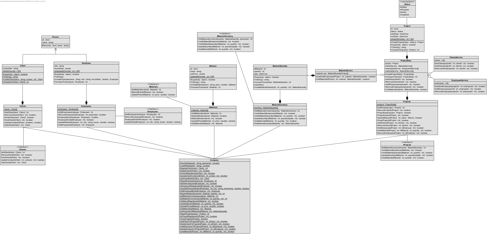

# Construction Management System

## Overview

The **Construction Management System** is designed to streamline the management of construction projects. Built with object-oriented programming (OOP) principles, the system emphasizes modularity, scalability, and maintainability, adhering to best practices and modern software design techniques.

---

## Features

- **N-Tier Architecture**: Organizes the application into 6 distinct layers to ensure data integrity and controlled access.
- **Singleton Design Pattern**: Guarantees unique instances for key collections such as clients, employees, and materials.
- **SOLID Principles**: Promotes clean and robust code design:
- **Generic Collections**: Utilizes `List` and `Dictionary` for dynamic and efficient data handling.
- **Error Handling**: Custom error codes simplify debugging and improve user experience.
- **Polymorphism**: Overloaded methods adapt based on input parameters.

---

## Technical Highlights

- **Initial Phase**: Arrays were employed for foundational implementation.
- **Advanced Structures**: Transitioned to generic collections for better scalability.
- **Interfaces**: Implements `IComparable<T>` for sorting and comparison.
- **XML Documentation**: Enhances code readability and future development.
- **Error Codes**: Dedicated codes for handling client, project, and material-related issues.
